CONBU イベント無線LAN環境向け Cisco vWLC セットアップマニュアル
====

- [参考リンク・資料](#reference)
- [前提とする環境](#requirements)
- [動作環境ごとのインストール手順](#vwlc_env)
  - [VMWare ESXi](#vwlc_env_vmware)
  - [さくらのクラウド](#sakura_cloud)
- [vWLCインストール共通手順](#install_common)
- [ライセンス](#license)
- [国コード](#country_code)
- [VLAN追加設定](#vlan_add)
- [SSIDの設定と注意点](#ssid)
- [IPv6のサポート/非サポート](#ipv6)
- [CleanAirの有効化](#cleanair)
- [NTP設定](#ntp)
- [APのJOIN](#ap_join)
- [APの証明書クリア手順](#ap_cert_clear)
- [APのWLC上の設定](#wlc_ap_conf)
- [トラブルシュート虎の巻](#ts_crib)
  - [VLANが混ざる その1](#flexconnect_vlan_mix_1)
  - [VLANが混ざる その2](#flexconnect_vlan_mix_2)
  - [無線LANクライアントの接続が頻繁に切れる場合](#client_load_balancing)

## <a name="reference"> 参考リンク・資料 </a>


- [Cisco Virtual Wireless Controller 導入ガイド](https://www.google.com/url?q=http://www.cisco.com/cisco/web/support/JP/111/1116/1116689_virtual-wlan-dg-00.html&sa=D&ust=1487673384885000&usg=AFQjCNGohhxbRNW2BpE4J4bU9vF0XSYuyQ)

## <a name="requirements"> 前提とする環境</a>
WIP

## <a name="vwlc_env"> 動作環境ごとのインストール手順 </a>

## <a name="vwlc_env_vmware"> VMware ESXi </a>

VMware ESXi向けにはovaファイル(例: AIR-CTVM-K9-8-0-120-0.ova)を用いてインストール作業をします。

手順はシンプルですが、対話式初期設定がスキップできなかったり、（バグのため）少しのミスで再インストールからやり直すことになったり、タイミング良くキーを押せないと再インストールからやり直しになったりします……。

1. WindowsマシンからvSphere ClientでESXiホストへ接続する
1. ファイル(F) → ovfテンプレートのデプロイ(D)... → vWLCの ova を選択
  1.  名前は適当につける。
  1.  シック・プロビジョニング(Lazy)を選択
  1.  ネットワークのマッピングはとりあえずそのまま
  1.  デプロイ後にパワーオンはしない
1.  ネットワーク構成の確認
  1.  概要： vWLCにはネットワークアダプタが2つあり、両方とも何かをアサインせねばならない。vWLCはローカルモード（全トラフィックがWLC経由）をサポートしないため、実質管理用インタフェイスが一つあればよいのだが、2つアサインしなければ進まない
  1.  デプロイしたvWLCを右クリックして 設定の編集
  1.  ネットワーク アダプタ 1 と 2 があり、1は管理セグメントに接続、2はダミーの仮想スイッチに接続する。
    1.  ネットワークアダプタ設定は1と2が逆になってしまうこともある。手順9まで進んでもpingが通らない場合には逆にして確認する。
1.  コンソールタブを表示させて vWLC をパワーオンする
1.  初回起動、自動的にディスクへのインストーラが走り(約1分)、完了すると自動的にリブート
1.  次回起動  Press any key to use this terminal as the default terminal が数回表示される。このときにすかさず何かキーを押す（あらかじめvSphere上でコンソールにフォーカスしておくとよい)。もしここで押せないと、ova デプロイからやり直しになる。

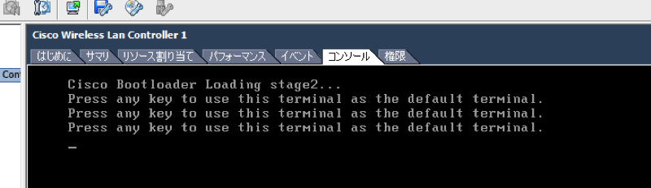

## <a name="sakura_cloud"> さくらのクラウド </a>

さくらのクラウドの場合、ovaファイルを利用するのではなくisoイメージからvwlcを作成します。isoイメージはCisco公式から落とすことができます。（要：Ciscoの会員登録）2017/03現在 [WLCダウンロード画面](https://software.cisco.com/download/type.html?mdfid=284464214&i=rm)
ここから必要なisoイメージをダウンロードしておいてください。

1. . さくらのクラウドにログインするさくらのクラウドにログインする
1. Ciscoから落としたisoイメージをさくらのクラウドにアップします。手順はこちらを参照してください。[ISOディスクアップロード](https://help.sakura.ad.jp/hc/ja/articles/206209061-ISO%E3%83%87%E3%82%A3%E3%82%B9%E3%82%AF%E3%82%A2%E3%83%83%E3%83%97%E3%83%AD%E3%83%BC%E3%83%89)
1. サーバを作成します。シンプルモードではなく詳細モードで作成します。
  1.  コア数１
  1.  メモリ３GB
  1.  ディスクレス
  1.  ディスクタイプ　SSDタイプ
  1.  ディスクソース　ブランク（空のディスク）
  1.  ディクスサイズ　２０GB
  1.  ISOイメージを使うの項目でアップしたISOディスクイメージを選択
  1.  別のストレージに保存するはチェックを”しない”
  1.  純仮想化モードを使う（Viritio)のチェックは”外す”
  
## <a name="install-common"> vWLCインストール共通手順 </a>

これ以降は対話インストールを行う。入力を間違えたら "-" で戻れると表示があるが、バグのため実際には壊れてしまい、次回起動時にクラッシュループするようになるので、- は使えない。間違えたら ova デプロイやインストールをやり直す。

1.  Would you like to terminate autoinstall? [yes]? yes
  1.  これを早めに入力しないとautoinstall が勝手に走ってしまう!
1.  System Name はそのままでOK
1.  Enter Administrative User Name: ${ここに共通ユーザ名}
1.  Enter Administrative Password: ${ここに共通パスワード}
  1. おそらくキーボードがUS配列になっているので、JISキーボードを使って @ を入力する際は別の記号として入力されるかもしれない。わからなくならなければWeb画面から変更できるので大丈夫
1.  Service Interface IP Address Configration [static][DHCP]: DHCP
  1. このインタフェイスは使わない
1. Management Interface IP Address : ${マネジメントセグメントのvWLC用IPv4アドレス}
  1. このインタフェイスに AP が JOIN する。Web/CLI もここ
1. Management Interface Netmask: ${マネジメントセグメントのネットマスク}
1. Management Interface Default Router: ${マネジメントセグメントのゲートウェイアドレス}
1. Management Interface VLAN Identifier (0 = untagged): 0
1. Management Interface Port Num [1 to 1]: 1
1. Management Interface DHCP Server IP Address: ${適当なアドレス}
  1. 使わない, あればDHCPサーバのアドレス
1.  Virtual Gateway IP Address: 1.1.1.1
  1.  Webログイン認証用ダミー IP アドレス。使わない
1.  Mobility/RF Group Name: CONBU01
2.  Network Name (SSID): CONBU
  1. 後で変更するのでここではなんでもよい
1.  Configure DHCP Bridging Mode [yes][NO]: no
1.  Allow Static IP Addresses [YES][no]: yes
1.  Configure a RADIUS Server now? [YES][no]: no
1.  Enter Country Code list (enter 'help' for a list of countries) [US]: J2
  1.  P型番の AP は J2, Q型番は J4
1.  Enable 802.11b Network [YES][no]: yes
1.  Enable 802.11a Network [YES][no]: yes
1.  Enable 802.11g Network [YES][no]: yes
1.  Enable Auto-RF [YES][no]: yes
1.  Configure a NTP server now? [YES][no]: no
1.  Configure the system time now? [YES][no] :yes
1.  would you like to configure IPv6 parameters [YES][no] :no
  1.  9.8からっぽい。とりあえずnoにした。
1.  Configureation correct? IF yes, system will save it and reset. [yes][NO]: yes
  1.  ここで no を選ぶと次回起動時にクラッシュループするので間違えた場合は ova デプロイからやり直す)
1.  自動的に再起動される
1.  再起動が完了したらWebブラウザから https://${マネジメントセグメントのvWLC用IPv4アドレス} (e.g. https://10.55.255.51 ) にアクセスしてみる
  1.  pingを実行する。 ping 10.255.254.1 が通らない場合にはネットワークアダプタ設定を確認し、1と2を逆にして確認する。

ovaのデプロイからやり直す場合は、vWLCのインスタンスを右クリックして「ディスクから削除(K)」を行ったあと 2 からの手順を行います。


## <a name="license"> ライセンス </a>

APをJOINさせるには評価版ライセンスを有効化する必要があります。

1.  Web からログインする
1.  MANAGEMENT -> Software Activation -> Licenses
1.  ap_count (か何か最初から入っているもの) をクリック、activate にして Set Status ボタンを押す
1.  EULAが表示されるので Accept
1.  Apply
1.  ライセンスを有効にするために WLC を再起動する。
  1.  COMMANDS -> Reboot -> Save and Reboot
  1.  再起動のタイミングでインストール手順6と同様に、コンソールで何かキーを押すことを忘れずに。。
1.  再起動後、Summary 画面に “200 Access Point Supported” と表示されていればOK


## <a name="country-code"> 国コード設定 </a>

APをJOINさせるには国コードを合わせる必要があります。国コードを変更するには一度インターフェイスをダウンさせる必要があるため、以下の手順を実施します。

1.  webGUI上部メニューから「WIRELESS」を選択し、次に左メニューから802.11a/n/acをプルダウンし、「Network」を選択する。
1.  Generalの項目の802.11a Network Statusの「Enabled」チェックボックスを外し、無効化します。外したら右上の「Apply」をクリックして設定適用してください。
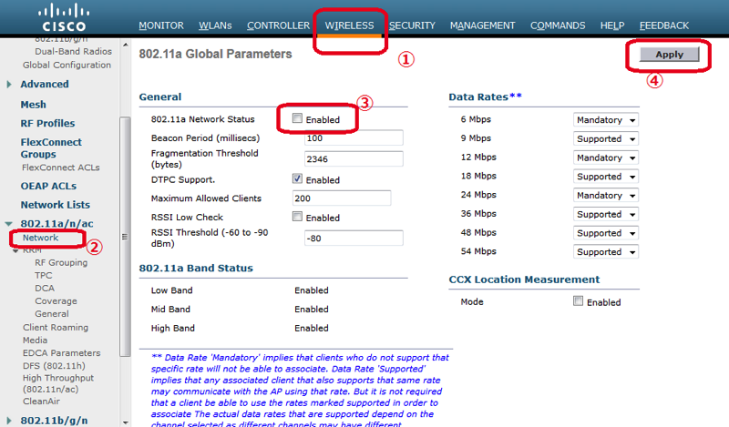
1.  手順2.と同じ手順を802.11b/g/nの「Network」で実施し、無効化します。
1.  左メニューから「Contry」の項目を選択し、国コードを設定します。J2,J4の両方を選択してください。選択したら右上の「Apply」をクリックして設定適用します。
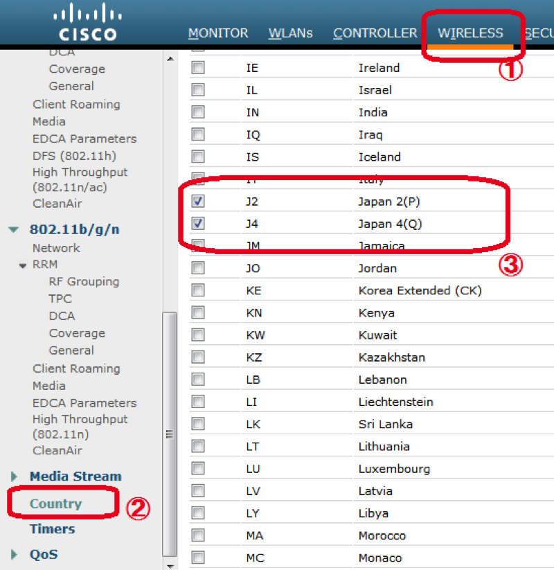
1.  手順2.手順3で無効化したインターフェイスを有効化します。


## <a name="vlan_add"> VLAN追加設定 </a>

1.  webGUI上部メニューから「CONTROLLER」を選択、左メニューから「Interface」を選択。Interfaceに新規にユーザ用VLANを追加します。Interface名は「user」など汎用的な名称で設定すると使いまわしがききます。
1.  ユーザ用VLAN番号はイベント指定の番号を追加。CONBUでは典型的には VLAN 3001 を利用。
1.  設定項目ではIPアドレス、netmask、Gatewayの割り当てを設定する。
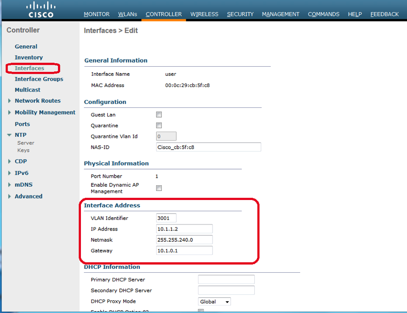

## <a name="ssid"> SSIDの設定と注意点 </a>
### プロファイルとSSIDの設定


プロファイルを変更し、対象イベント用に設定する。
- WebGUI上部メニューからWLANs > 左メニューから「WLANs 」を選択。
  - SSIDを変更することが可能になったので、プロファイル新規作成をするときに、プロファイルを次回イベント時に使いまわせるようにプロファイル名は統一したい。
  - ユーザ用は「CONBU-wifi-User」とか。

作成したプロファイルはSSIDに紐づける必要がある。 WebGUI上部メニューから「WLANs」を選択し、SSIDを作成もしくは編集する。

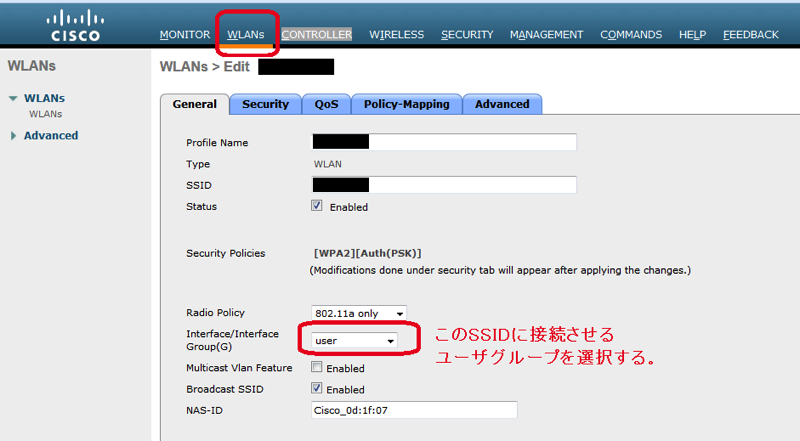

2.4GHz(802.11g)か5GHz(802.11a)かあるいは両方(All)かを状況に応じて選択する。

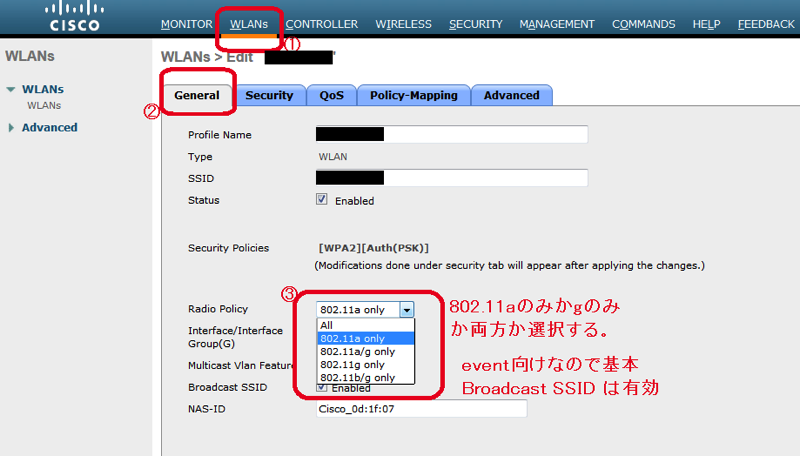


SSID、PSK等を設定する。PSK設定は対象プロファイルのSecurityタブ > Layer2　タブ内の下部にある。

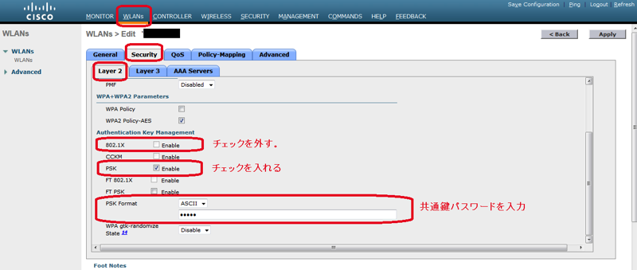

はまりポイントとして、Advancedタブの以下の項目について確認していく。

- 「Client Exclusion」 の項目についてはEnabledのチェックを外す
- 「P2P Blocking Action」をDropにする
  - これが無いと、同一APのSSIDに接続しているクライアント間の通信が遮断できない
  - 但しマネジメントセグメントでは無効にしておく
- 「FlexConnect Local Switching」の項目にチェックを入れ、enabledとする。

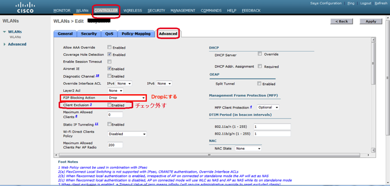

- 「Client Load Balancing」は、複数AP間でクライアントを融通しあい極端にどこかのAPにクライアント数が偏らないようにしてくれる設定なので、基本的には入れておく。
  - 手動でクライアント数のバランシングを行うオペレーションが不要になる
  - 但し後述するように稀に接続断の頻発という事象を引き起こす場合がある
- 「Clinent Band Select」の項目は2.4GHz/5GHz両方からSSIDを提供するときに、5GHz(802.11a)に優先して接続する設定なので、SSIDの設定状況に応じて選択する。
  - 2.4GHzと5GHzとでSSIDを分けた場合は不要、それ以外の場合は基本的に有効にしておくこと
  
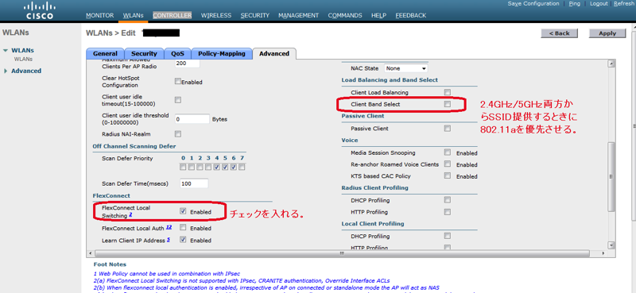

## <a name="ipv6"> IPv6のサポート/非サポート: RA Guardの設定 </a>

IPv6をユーザに提供する場合、RA Guardを外す必要がある。

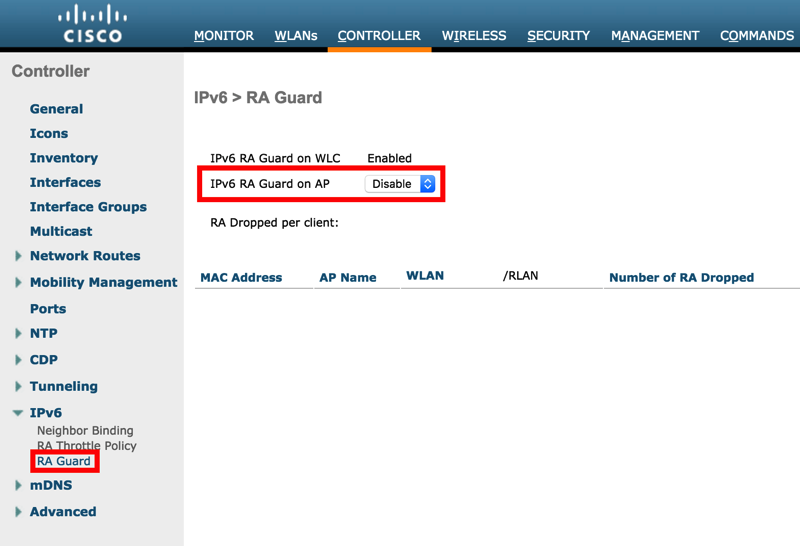

## <a name="cleanair"> CleanAirの有効化 </a>

<span>802.11a/n/acと802.11b/g/nともに CleanAirを有効化しておく。

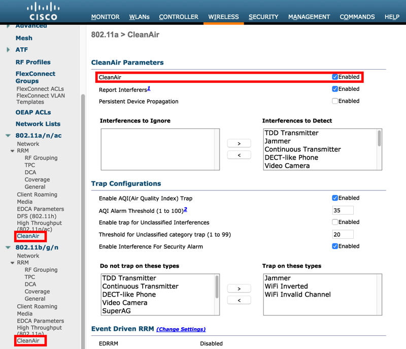

## <a name="ntp">NTP設定</a>

1.  WebGUI上部メニューから「CONTROLLER」を選択、左メニューから「NTP」をプルダウンし、「server」を選択。
2.  サーバIPアドレスとして、マネジメントセグメント内のNTPサーバアドレスを設定します。

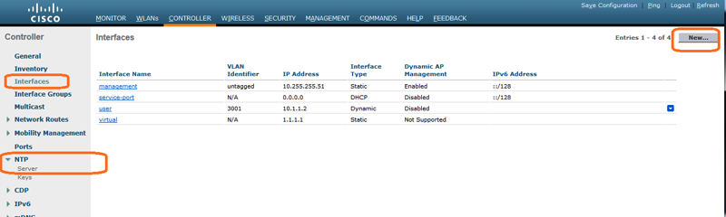

## <a name="ap_cert_clear"> APの証明書クリア手順 </a>

APへ以下の設定を行います。 AP内に登録されている旧証明書をクリアして新証明書をAPに導入させる必要があります。DHCPの場合はこの手順だけでもOK。

enableモードで以下を実行します。

```
clear capwap ap ip address
clear capwap ap ip default-gateway
clear capwap private-config
```

その後、以下の様にreloadコマンドで再起動させます

```
reload
```

再起動後、show capwap ip config を実行すると、WLCの接続先設定が初期化されているのがわかる。
ここに改めていかの様にvWLCのアドレスを設定します。

```
capwap ap controller ip address 10.255.255.51
```

なおenableモードに入れない場合、工場出荷状態に初期化する必要があります。AP電源投入直後に"#####"とファームウェアが展開されている時にEscキーを押すことでrommonモードに入ることが出来ます。ここで以下の様に入力して設定を消し飛ばしましょう("ap:"はプロンプトです)。

```
ap: delete flash:private-multiple-fs
ap: reset
```

再起動後に"capwap ap controller ip address"をやり直します。

## <a name="ap_join"> APのJOIN </a>

APに静的アドレスを割り当てている場合は、コンソールに入り enable 後 以下のような設定を行います。

```
capwap ap ip address 10.255.1.101 255.255.252.0
capwap ap ip default-gateway 10.255.1.1
capwap ap controller ip address 10.255.255.51
```

それぞれこの設定におけるマネジメントネットワークの想定は以下の通りです。

- ネットワーク: 10.255.1.0/24
- デフォルトゲートウェイのアドレス: 10.255.1.1
- APのアドレス: 10.255.1.101
- vWLCのアドレス: 10.255.255.51

このコマンドは write の必要はありません。
このAPから controller への疎通があれば JOIN しようとするはずです。
AP名はWLC上から変更します。


## <a name="wlc_ap_conf"> APのWLC上の設定 </a>

上方「WIRELESS」のタブ→左メニューから「All AP」→対象APを選択し、JOINしたAPの諸設定をする。

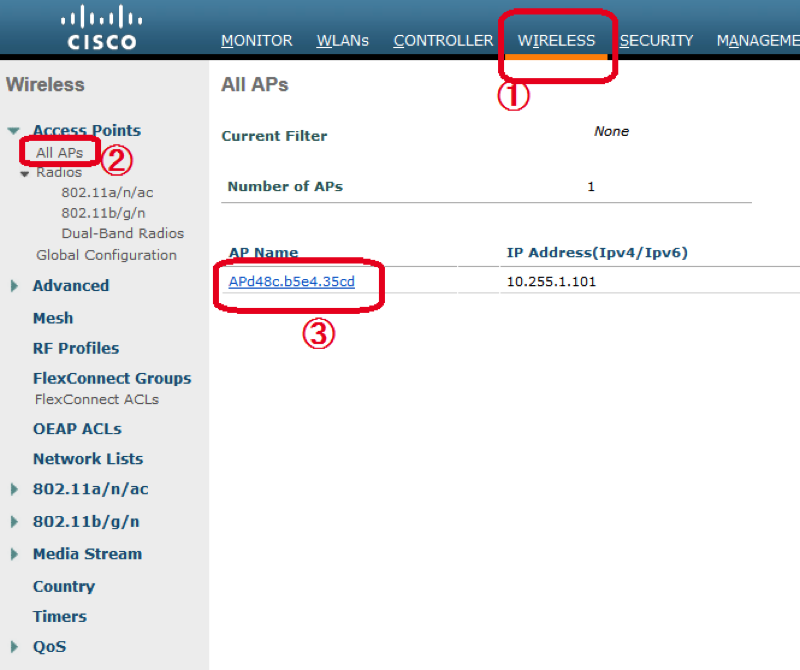

- まず、AP High Availability のNameに何かしら文字列を入力する必要がある
  - 入れないと各種設定でエラーになる

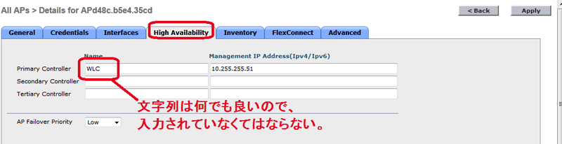

- AP名とAP modeをそれぞれ変更する。
  - AP名はそれぞれのイベントでの命名規則に沿って設定する。
- AP modeをFlexConnectに変更する。
  - なおAPをWLCに接続した直後にファームウェアの更新が走る場合がある。この場合、AP modeを変更できない。更新が終了し、再度WLCに接続されるまで待つこと。

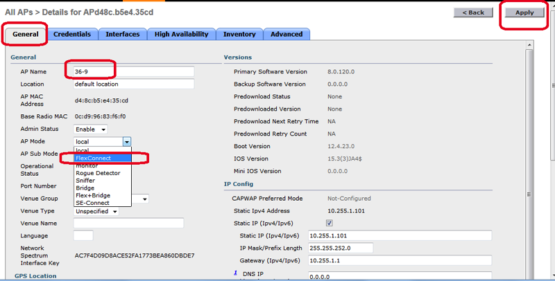   

 
- VLAN support のチェックを入れる。

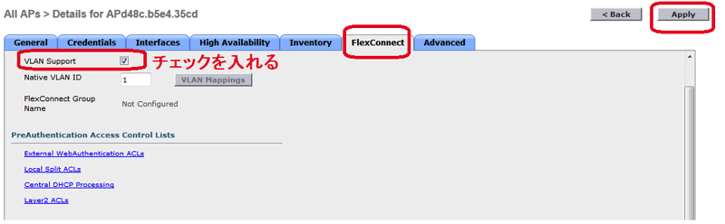

Applyを推して適用後、以下を実行する

- flex connect のチェックが入っていることを確認
- AP-Groupの作成と作成したAP-groupへのAPのJOIN
  - 左メニューのAdvancedから「AP group 」を選択。
  - 対象のAP-groupを選択し、WLANsのタブで出力したいSSIDを登録
  - APのチャンネルと電波出力が固定になっていないか、確認する。(前回利用時に固定設定している場合がある)

## <a name="ts_crib"> トラブルシュート虎の巻 </a>

### <a name="flexconnect_vlan_mix_1"> セグメント(VLAN)が混ざったような挙動を示す場合の対処 その1 </a>

APごとの__VLAN Support__が正しく設定されていないと、全てのトラフィックが上流にタグ無しで出て行く場合がある。
"その1"で述べた内容が大丈夫でも事象が継続する場合、接続中のAPの当該項目を確認すること。

### <a name="flexconnect_vlan_mix_2"> FlexConnect利用時にセグメント(VLAN)が混ざったような挙動を示す場合の対処 その2</a>

WLCにおけるこれまでの設定順序を逸脱した場合やWLANsにてSSIDの増減をAP登録後に行った場合に、USER用SSIDに接続しているにも関わらずMGMTセグメントのアドレスが降ってくるor疎通ができてしまうなど、VLAN-SSIDのマッピングが崩れたような事象が発生することがある。このような場合、FlexConnect Groupsを設定して修正できる。

1. FlexConnect Groupを作成する
  1. WIRELESS – FlexConnect Groups にてNew..ボタンを押しグループを新規作成する(以下は作成済み)

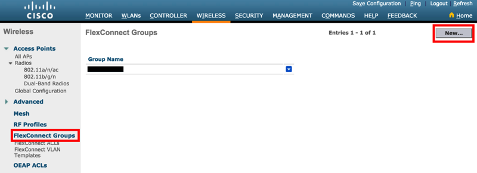

1. APをFlexConnect Groupに登録する
  1. 全APを登録すること。漏れていると一部APに事象が残る。

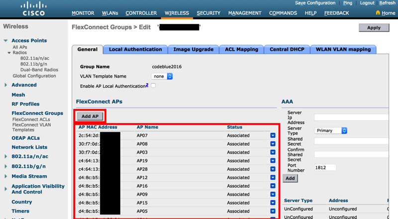

1. WLAN-VLAN Mappingを設定する
  1. SSIDと上流VLAN IDの組合せをAddする

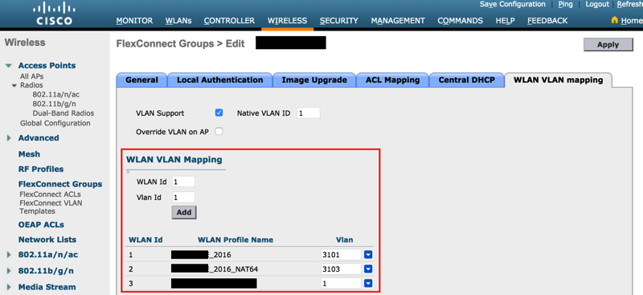

本来は事前に設定したInterfaceとSSIDの設定にしたがってマッピングが作成されるが、SSIDの削除／再追加などを行うとこれが崩れる場合がある。この様な場合にこの手順を踏む。


### <a name="client_load_balancing"> 無線LANクライアントの接続が頻繁に切れる場合 </a>

Client Load Balancing 機能が悪い方向に働いている可能性があります。
WLANｓ以下のSSIDに対応するプロファイルの「Client Load Balancing」のチェックボックスを外すと改善する場合があります。
ただし設定変更時には一度すべてのクライアントの接続が切れるので注意。
