# CONBU イベント無線LAN環境向け<br> Cisco vWLC セットアップマニュアル

- [参考リンク・資料](#reference)
- [前提とする環境](#requirements)
- [動作環境ごとのインストール手順](#vwlc_env)
  - [VMWare ESXi](#vwlc_env_vmware)
  - [さくらのクラウド](#sakura_cloud)
- [vWLCインストール共通手順](#install_common)
- [ライセンス](#license)
- [国コード](#country_code)
- [VLAN追加設定](#vlan_add)
- [Tx Power Control(TPC) version の設定](#tpc_version)
- [SSIDの設定と注意点](#ssid)
- [IPv6のサポート/非サポート](#ipv6)
- [CleanAir の有効化](#cleanair)
- [NTP設定](#ntp)
- [APの初期化](#ap_reset)
  - [APの証明書クリア手順](#ap_cert_clear)
  - [APのJOIN](#ap_join)
- [APのWLC上の設定](#wlc_ap_conf)
- [AP-Groupとの紐付け処理](#ap_join)
- [トラブルシュート虎の巻](#ts_crib)
  - [VLANが混ざる その1](#flexconnect_vlan_mix_1)
  - [VLANが混ざる その2](#flexconnect_vlan_mix_2)
  - [無線LANクライアントの接続が頻繁に切れる場合](#client_load_balancing)
  - [各APのLoadProfileステータスがFailedになる](#loadprofile_failed)
  - [無線LANからWLCのGUIにアクセスできない場合](#management_via_wireless)
  - [WLCとAPとの接続に不具合が見受けられる場合](#client_load_balancing)


## <a name="reference"> 参考リンク・資料 </a>

- [Cisco Virtual Wireless Controller 導入ガイド](https://www.google.com/url?q=http://www.cisco.com/cisco/web/support/JP/111/1116/1116689_virtual-wlan-dg-00.html&sa=D&ust=1487673384885000&usg=AFQjCNGohhxbRNW2BpE4J4bU9vF0XSYuyQ)

## <a name="requirements"> 前提とする環境</a>

* 複数台の AP(Cisco Aironet) 配置する構成を取る場合。

## <a name="vwlc_env"> 動作環境ごとのインストール手順 </a>


### <a name="vwlc_env_vmware"> VMware ESXi </a>

VMware ESXi向けにはovaファイル(例: AIR-CTVM-K9-8-0-152-0.ova)を用いてインストール作業をします。

手順はシンプルですが、対話式初期設定がスキップできなかったり、（バグのため）少しのミスで再インストールからやり直すことになったり、タイミング良くキーを押せないと再インストールからやり直しになったりします……。

1. WindowsマシンからvSphere ClientでESXiホストへ接続する
1. ファイル(F) → ovfテンプレートのデプロイ(D)... → vWLCの ova を選択
  1. 名前は適当につける。
  1. シック・プロビジョニング(Lazy)を選択
  1. ネットワークのマッピングはとりあえずそのまま
  1. デプロイ後にパワーオンはしない
1. ネットワーク構成の確認
  1. 概要: vWLCにはネットワークアダプタが2つあり、両方とも何かをアサインせねばならない。<br>vWLCはローカルモード（全トラフィックがWLC経由）をサポートしないため、実質管理用インタフェイスが一つあればよいのだが、**2つアサインしなければ進まない**
  1. デプロイしたvWLCを右クリックして 設定の編集
  1. ネットワーク アダプタ1 と アダプタ2 があり、アダプタ1 は管理セグメントに接続、 アダプタ2 はダミーの仮想スイッチに接続する。
    1. ネットワークアダプタ設定は アダプタ1 と アダプタ2 が逆になってしまうこともある。<br>手順9まで進んでもpingが通らない場合には逆にして確認する。
1. コンソールタブを表示させて vWLC をパワーオンする
1. 初回起動、自動的にディスクへのインストーラが走り(約1分)、完了すると自動的にリブート
1. 次回起動  `Press any key to use this terminal as the default terminal` が数回表示される。<br>このときにすかさず何かキーを押す（あらかじめvSphere上でコンソールにフォーカスしておくとよい)。もしここで押せないと、ova デプロイからやり直しになる。


### <a name="sakura_cloud"> さくらのクラウド </a>

さくらのクラウドの場合、ovaファイルを利用するのではなくisoイメージからvwlcを作成します。isoイメージはCisco公式から落とすことができます。（要：Ciscoの会員登録）2017/03現在 [WLCダウンロード画面](https://software.cisco.com/download/type.html?mdfid=284464214&i=rm)
ここから必要なisoイメージをダウンロードしておいてください。

1. さくらのクラウドにログインするさくらのクラウドにログインする
1. Ciscoから落としたisoイメージをさくらのクラウドにアップします。手順はこちらを参照してください。[ISOディスクアップロード](https://help.sakura.ad.jp/hc/ja/articles/206209061-ISO%E3%83%87%E3%82%A3%E3%82%B9%E3%82%AF%E3%82%A2%E3%83%83%E3%83%97%E3%83%AD%E3%83%BC%E3%83%89)
1. サーバを作成します。シンプルモードではなく**詳細モード**で作成します。


### 1. サーバープラン

|||
|-:|-:|
| 仮想コア | 1 |
| メモリ | 3 GB |


### 2. ディスク

|||
|-:|-:|
| 新規ディスクを作成 |
| ディスクプラン | SSDプラン |
| ディスクソース | ブランク |
| ディスクサイズ | 20GB |
| ISOイメージを使う | **ここは各自アップロードした物を選択** |
| 別ストレージに収容する | チェック・オフ |
| 準仮想化 モードを使う(Virtio) | **チェック・オフ** |


### 3. NIC

|||
|-:|-:|
| 切断 |
| 準仮想化 モードを使う(Virtio) | **チェック・オフ** |


### 6. サーバの情報


### 7. その他のオプション

**作成後すぐ起動のチェックはオフする**


### NIC の追加

できた仮想マシンを選択し NIC タブから新規NIC を作成し、 管理セグメントの Switchを接続し仮想マシーンを起動する。

## <a name="install-common"> WLCインストール共通手順 </a>

### 設定値シート

参考値を記載する。

| | Description |
|:-|:-|
| `ホスト名`         | ホスト名<br>例: `18b-cc-vwlc01` |
| `${共通ユーザ名}`  | Projectユーザー名<br>例: `mekabu` |
| `${共通パスワード}` | Project パスワード<br>例; `conbu` |
| Service Interface IP Address: | 設定しないと進めないため、ドキュメントIPアドレスを利用 |
| Service Interface Netmask:     | 設定しないと進めないため、 /30 設定 |
| `${マネジメントセグメントIPv4アドレス}` | 例: `10.20.0.21` |
| `${マネジメントセグメントのネットマスク}` | 例: `255.255.255.0` |
| `${マネジメントセグメントのゲートウェイアドレス}` | 例: `10.20.0.4` |
| `${マネジメントセグメントの適当なアドレス}` | 設定しないと進めないため、設定<br>WLC前後のアドレスを利用するとわかりやすい<br>あとで `0.0.0.0` に変更する<br> 例: `10.20.0.22` |
| Virtual Gateway IP Address: | Webログイン認証用ダミーIPアドレスCONBUでは利用しないため、ドキュメントIPアドレスを使用<br>例: `203.0.113.1` |
| Mobility/RF Group Name: | WLCを複数連携する時に必要いなるが、vWLCではHA構成を取れないため適当に設定<br>例: `CONBU01` |
| Network Name (SSID): | Installer 中で入力が必須のため設定するが、あとで変更することも可能<br>例: `CONBU` |
| `${現在の日付}` | 時刻設定は後でNTPで設定するが、合わせておく<br>例: `06/23/18`
| `${現在の時刻}` | 時刻設定は後でNTPで設定するが、合わせておく<br>例: `13:56:00`


### vWLCインストール共通手順

  これ以降は対話インストールを行う。入力を間違えたら "-" で戻れると表示があるが、バグのため実際には壊れてしまい、次回起動時にクラッシュループするようになるので、- は使えない。間違えたら ova デプロイやインストールをやり直す。

  1. Would you like to terminate autoinstall? [yes]: `yes`
      * **これを早めに入力しないと autoinstall が勝手に走ってしまう!**
  2. System Name [Cisco_07:fc:3e] (31 characters max): `ホスト名`


  1. Enter Administrative User Name: `${共通ユーザ名}`
  2. Enter Administrative Password: `${共通パスワード}`
      * キーボードがUS配列になっているので、JISキーボードを使って `@` を入力する際は別の記号として入力されるかもしれない。<br>わからなくならなければWeb画面から変更できるので大丈夫


  1. Service Interface IP Address Configration [static][DHCP]: `static`
      * **このインタフェイスは使わない** が、NICを同一ネットワークに刺してると問題になる可能性があるため `static` で設定する。
  1. Service Interface IP Address: `192.0.2.1`
  1. Service Interface Netmask: `255.255.255.252`


  1. Management Interface IP Address: `${マネジメントセグメントIPv4アドレス}`
      * このインタフェイスに AP が JOIN する。Web / CLI もここ
  1. Management Interface Netmask: `${マネジメントセグメントのネットマスク}`
  1. Management Interface Default Router: `${マネジメントセグメントのゲートウェイアドレス}`
  1. Management Interface VLAN Identifier (0 = untagged): `0`
  1. Management Interface Port Num [1 to 1]: `1`
  1. Management Interface DHCP Server IP Address: `${マネジメントセグメントの適当なアドレス}`
      * **使わない** `Management Interface` と同じ、ネットワーク内のアドレスを適当にアサインする。


  1. Virtual Gateway IP Address: `203.0.113.1`
      * Webログイン認証用ダミー IPアドレス。


  1. Mobility/RF Group Name: `CONBU01`
  2. Network Name (SSID): `CONBU`
      * 後で変更するのでここではなんでもよい


  1. Configure DHCP Bridging Mode [yes][NO]: `no`
  1. Allow Static IP Addresses [YES][no]: `yes`
      * DHCP で IPアドレス を配布するが、 Static IP も許容するか。
  1. Configure a RADIUS Server now? [YES][no]: `no`
  1. Enter Country Code list (enter 'help' for a list of countries) [US]: `J2,J4`
      * P型番の AP は `J2` <br>Q型番の AP は `J4`


  1. Enable Auto-RF [YES][no]: `yes`
  1. Configure a NTP server now? [YES][no]: `no`
      * 後ほど、 WebGUI で設定するのでとりあえず `no`
  1. Configure the system time now? [YES][no]: `yes`
  1. Enter the date in MM/DD/YY format: `${現在の日付}`
  1. Enter the time in HH:MM:SS format: `${現在の時刻}`


  1. would you like to configure IPv6 parameters [YES][no]: `no`
  2. Configureation correct? IF yes, system will save it and reset. [yes][NO]: `yes`
      * **ここで no を選ぶと次回起動時にクラッシュループするので間違えた場合は ova デプロイからやり直す)**
  3. 自動的に再起動される


  1. 再起動が完了したらWebブラウザから https://`${マネジメントセグメントのvWLC用IPv4アドレス}` <br>(e.g. https://10.55.255.51 ) にアクセスしてみる
      * ping を実行する。 ping 10.55.255.51 が通らない場合にはネットワークアダプタ設定を確認し、`インターフェイス1` と `インターフェイス2` を逆にして確認する。


  ovaのデプロイからやり直す場合は、vWLCのインスタンスを右クリックして「ディスクから削除(K)」を行ったあと 2 からの手順を行います。


## <a name="license"> ライセンス </a>

WLC デフォルトライセンスでは、 12台以上の AP(Access Point) を Join することができないため評価版ライセンスを有効化する必要があります。<br>
また、再起動しないと反映されないため、インストール直後にやるとこを推奨します。

1. Web からログインする
2. 「MANAGEMENT」 -> Software Activation -> Licenses
3. ap_count (か何か最初から入っているもの) をクリック、activate にして Set Status ボタンを押す
4. EULAが表示されるので Accept
5. Apply
6. ライセンスを有効にするために WLC を再起動する。
    1. COMMANDS -> Reboot -> Save and Reboot
    2. 再起動のタイミングでインストール手順6と同様に、コンソールで何かキーを押すことを忘れずに。。
7. 再起動後、Summary 画面に “200 Access Point Supported” と表示されていればOK


## <a name="country-code"> 国コード設定 </a>

APをJOINさせるには国コードを合わせる必要があります。国コードを変更するには一度無線を停波しないとできないため、ここで実施する。<br>また、 <a name="install-common"> WLCインストール共通手順 </a> で実施しているため確認になる。


1. webGUI上部メニューから「WIRELESS」を選択し、次に左メニューから `802.11a/n/ac` をプルダウンし、「Network」を選択する。

2. Generalの項目の `802.11a Network Status` の「Enabled」チェックボックスを外し、無効化します。外したら右上の「`Apply`」をクリックして設定適用してください。


1. 手順2.と同じ手順を `802.11b/g/n` の「Network」で実施し、無効化します。

1. 左メニューから「Contry」の項目を選択し、国コードを設定します。 **J2,J4** の両方を選択してください。選択したら右上の「`Apply`」をクリックして設定適用します。


1. 手順2.手順3で無効化したインターフェイスを有効化します。


## <a name="vlan_add"> VLAN追加設定 </a>

### 前提条件

CONBU では、Flexconnect Mode を利用しているため、 IPアドレスは設定上必要なため設定するが、実際は、 VLAN ID の設定ができれば何でも良い。

ドキュメントとして記載するため、また(1.1.1.1で問題になったため)ドキュメントIPアドレスを利用する。

参考までに、 Erlang & Elixir Fest 2018 の設定情報を記載する。

| Floor | Interface Name | VLAN Identifier | IP Address    | Netmask         | Gateway       |
|:------|:---------------|:----------------|:--------------|:----------------|:--------------|
| 2F    | venue_2f_mgmt  | 2200            | 192.51.100.1  | 255.255.255.252 | 192.51.100.2  |
|       | venue_2f_user  | 2216            | 198.51.100.5  | 255.255.255.252 | 192.51.100.6  |
|||
| 5F    | venue_5f_mgmt  | 2500            | 192.51.100.33 | 255.255.255.252 | 192.51.100.34 |
|       | venue_5f_user  | 2516            | 198.51.100.37 | 255.255.255.252 | 192.51.100.37 |


## VLAN追加設定

1. webGUI上部メニューから「CONTROLLER」を選択、左メニューから「Interfaces」を選択。Interfaceに新規にユーザ用VLANを追加します。
2. ユーザ用VLAN番号はイベント指定の番号を追加。
3. 設定項目ではIPアドレス、netmask、Gatewayの割り当てを設定する。


## <a name="tpc_version">Tx Power Control(TPC) version の設定</a>

カンファレンスネットワークは一部屋に多くの Client (150-200)を接続する環境のため、 TPC の設定を最適化しておく。


* [Cisco Wireless LAN Controller コンフィギュレーション ガイド リリース 8.0 - RRM の設定 [Cisco Wireless LAN Controller ソフトウェア] - Cisco](https://www.cisco.com/c/ja_jp/td/docs/wl/wllancntrller/wllancntrllersw/cg/001/b_cg80/b_cg80_chapter_010000011.html)

| version | Description |
|---------|-------------|
| `TPCv1` | 通常電力を低く維持することでキャパシティを増やし、干渉を減らします。<br>Cisco WLC は、3番目に送信電力の強いネイバーによるアクセス ポイントの認識に応じて、アクセス ポイントの送信電力の調整を試行します。|
| `TPCv2` | 高密度のネットワークに適しています。<br>このモードでは、ローミングの遅延およびカバレッジ ホールのインシデントが多く発生する可能性があります。|

1. 「WIRELESS」=> 「802.11a/n/ac」=> 「RRM」=>「TPC」
1. Interference Optimal Mode (TPCv2) に変更
2. 同様に、「802.11b/g/n」も実施する

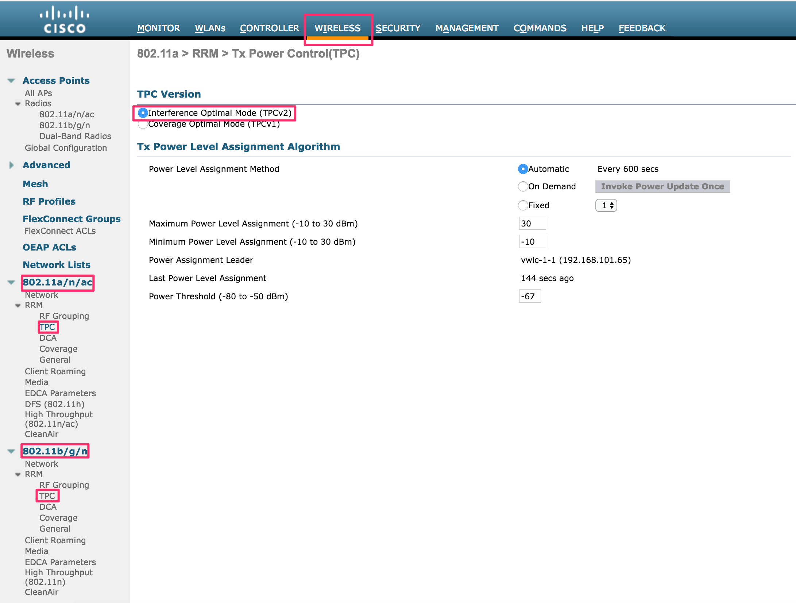


## <a name="ssid"> SSIDの設定と注意点 </a>

### 設計思想

WLAN ID は `1` は デフォルトでCLI設定時に作成されるので `1-9` を利用しないようにした。
それから、`11-512` まで利用可能。

階ごとに、WLANを作成することもあるため階ごとに10の位を分けるのがオススメ。
また、mgmtは最初に作成使用するため、 `x1` で作成するのがオススメ。


| Floor | WLAN ID | Profile Name | WLAN SSID   |
|:------|:--------|:-------------|:------------|
| 2F    | 11      | conbu-staff  | conbu-staff |
|       | 12      | user-wifi    | user-wifi   |
|||
| 5F    | 21      | conbu-staff  | conbu-staff |
|       | 22      | user-wifi    | user-wifi   |


### プロファイルとSSIDの設定


プロファイルを変更し、対象イベント用に設定する。
- WebGUI上部メニューからWLANs > 左メニューから「WLANs」を選択。


作成したプロファイルはSSIDに紐づける必要がある。 WebGUI上部メニューから「WLANs」を選択し、SSIDを作成もしくは編集する。


2.4GHz(802.11g)か5GHz(802.11a)かあるいは両方(All)かを状況に応じて選択する。


SSID、PSK等を設定する。PSK設定は対象プロファイルのSecurityタブ > Layer2 タブ内の下部にある。


はまりポイントとして、Advancedタブの以下の項目について確認していく。


- 「Client Exclusion」 の項目についてはEnabledのチェックを外す
- 「P2P Blocking Action」をDropにする
  - これが無いと、同一APのSSIDに接続しているクライアント間の通信が遮断できない
  - 但しマネジメントセグメントでは無効にしておく
- 「FlexConnect Local Switching」の項目にチェックを入れ、enabledとする。

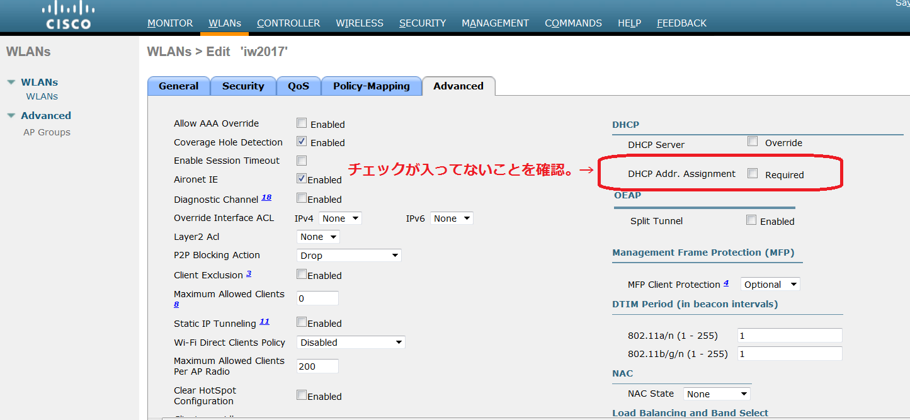

- 「DHCP Addr. Assignment」の Required の項目にチェックが入ってないことを確認する。
(有効になっているとIPv6のRAを妨げてしまうため)


- 「Client Load Balancing」は、複数AP間でクライアントを融通しあい極端にどこかのAPにクライアント数が偏らないようにしてくれる設定なので、基本的には入れておく。
  - 手動でクライアント数のバランシングを行うオペレーションが不要になる
  - 但し後述するように稀に接続断の頻発という事象を引き起こす場合がある
- 「Clinent Band Select」の項目は2.4GHz/5GHz両方からSSIDを提供するときに、5GHz(802.11a)に優先して接続する設定なので、SSIDの設定状況に応じて選択する。
  - 2.4GHzと5GHzとでSSIDを分けた場合は不要、それ以外の場合は基本的に有効にしておくこと

## <a name="rfprofile"> RF Profile 設定によるクライアント接続帯域の設定 </a>

### 設計思想

低帯域のbitrateでクライアントが接続すると、そのクライアントがボトルネックとなり、Wifi全体が遅くなるため、低bitrateのクライアント接続を絞る。
設定のステータスには3種類あり、それぞれの説明は以下になる。


Clientが接続するさいに接続される bitrate の下限値が `Mandatory` でありサポートしていれば、 `Supported` までの bitrate で接続する。


|||
|:-|:-|
| `Disabled`  | 通信に使用するデータレートは、クライアントが指定します。|
| `Mandatory` | クライアントは、このコントローラ上のアクセスポイントにアソシエートするにはこのデータレートをサポートしている必要があります。|
| `Supported`  | アソシエートしたクライアントは、このデータレートをサポートしていれば、このレートを使用してアクセス ポイントと通信することができます。 ただし、クライアントがこのレートを使用できなくても、アソシエートは可能です。|


最近のCONBUでは下記の設定をしている

* RF-Low:
    * `disable`: 1, 2, 5.5, 6, 9, 11, 12, 18
    * `mandatory`: 24, 36
    * `supported`: 48, 54

* RF-High:
    * `disable`: 1, 2, 5.5, 6, 9, 11, 12, 18, 24
    * `mandatory`: 36,
    * `supported`: 48, 54

参考: [Cisco Aironet 3600 シリーズ アクセス ポイント - Cisco](https://www.cisco.com/c/ja_jp/products/collateral/wireless/aironet-3600-series/data_sheet_c78-686782.html)

### クライアント接続帯域の設定

上部メニュー「WIRELESS」から左メニューで「RF Profile」画面を開き、右上の「New」を選択しProfileを作成する。

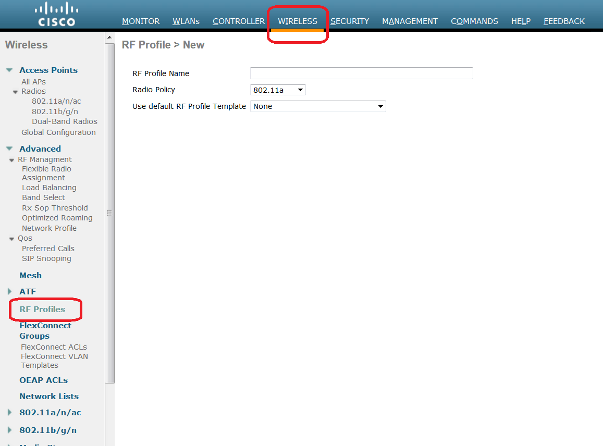

作成後、同画面にて作成したProfileを選択し、「802.11」タブを選択。接続させたくない帯域を「disabled」に変更する。
なお「Mandatory」は接続対応必須、「supported」はクライアント側がその帯域に対応しているのならば、クライアントに選択肢として提示するという設定。

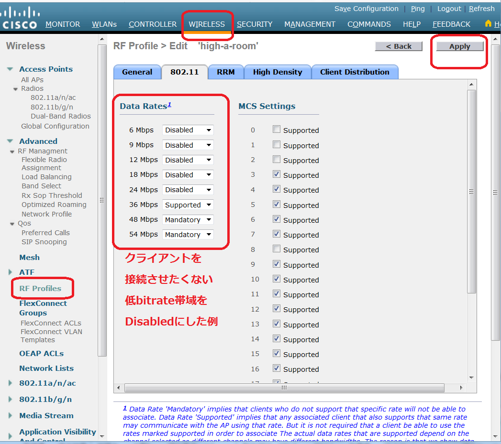

このRF Profile設定は後述するAP-Group設定で使用することになる。


## <a name="power"> APの電波出力の確認 </a>

  - APのチャンネルと電波出力が固定になっていないか、確認する。(前回利用時に固定設定している場合がある)
    - 数値は1がMAX、6がMIN、* は自動出力調整で運用されている。必要に応じて出力を下げる。ただし、出力設定変更した場合にはAPは再起動するので、そのAPに接続したユーザは切断されることに注意する。

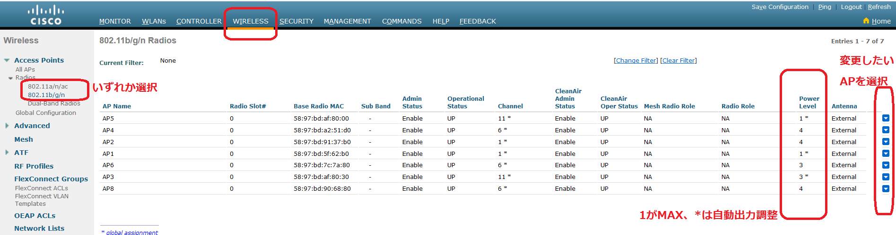


## <a name="ipv6"> IPv6のサポート/非サポート: RA Guardの設定 </a>

IPv6をユーザに提供する場合、RA Guardを外す必要がある。


## <a name="cleanair"> CleanAir の有効化 </a>

`802.11a/n/ac` と `802.11b/g/n` ともに CleanAir を有効化しておく。

1. `CleanAir` 右の `Enabled` をチェック
1. `Apply` する。 ついでに `Save Configuration` もしとこう。
1. `Event Driven RRM` 右の `(Change Settings)` をクリックして RRM 設定に入る


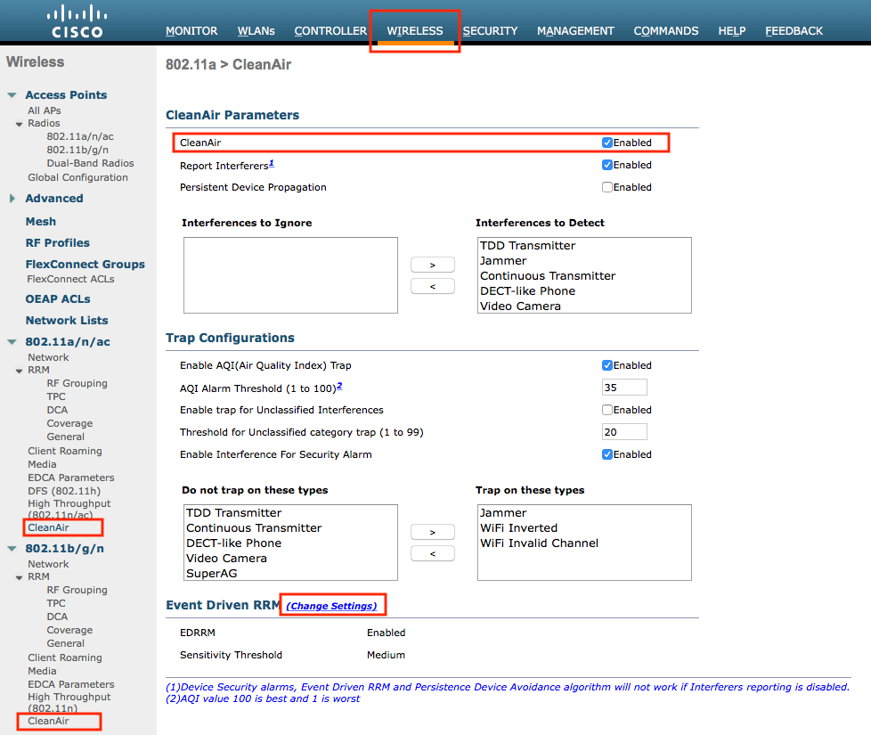

1. `Avoid Persistent Non-WiFi Interference` を有効にする<br>
      Cisco WLC が継続的な WiFi 以外の干渉を無視できるようにします。
1. `Event Driven RRM` 項目の `DERRM` を `Enabled` にチェック
1. `Sensitivity Threshold` は `Medium` 設定<br>
      干渉しきい値は以下の通りになってる。
      * low: 35
      * medium: 50
      * high: 60
1. `Apply` する。 ついでに `Save Configuration` もしとこう。

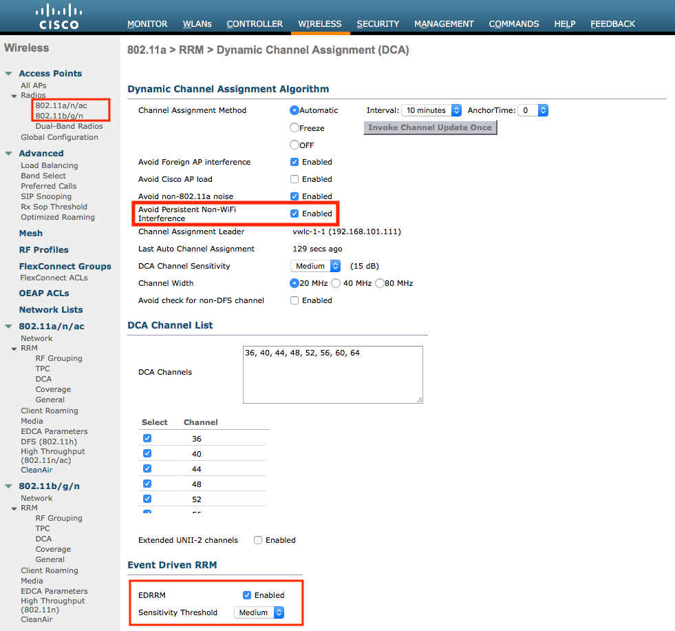

WLCのバージョンにより、`CleanAir Admin Status` が有効でない場合があるので確認する

1. `802.11a/n/ac` と `802.11b/g/n` ともに確認しよう。

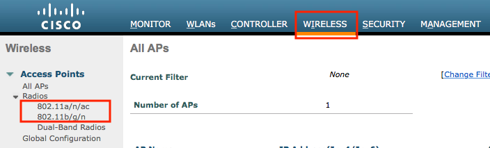

1. 画面右側の `▼` をクリックして、 `Configure` をクリック

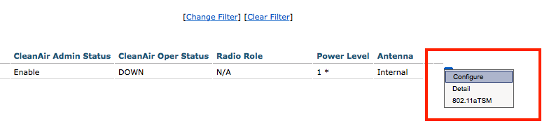


1. `CleanAir Admin Status` が `Enabled` であることを確認する。
1. 同様に、`802.11a/n/ac` と `802.11b/g/n` 両方確認する。

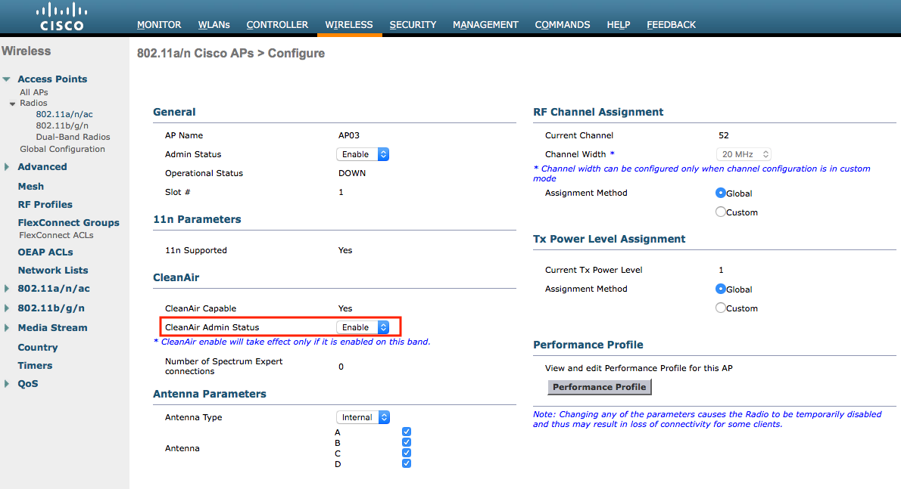


## <a name="ntp">NTP設定</a>

1.  WebGUI上部メニューから「CONTROLLER」を選択、左メニューから「NTP」をプルダウンし、「server」を選択。
2.  サーバIPアドレスとして、マネジメントセグメント内のNTPサーバアドレスを設定します。


## <a name="ap_reset"> APの初期化 </a>

### <a name="ap_cert_clear"> APの証明書クリア手順 </a>

APへ以下の設定を行います。 AP内に登録されている旧証明書をクリアして新証明書をAPに導入させる必要があります。DHCPの場合はこの手順だけでもOK。

Cisco デフォルトの `username` と `password` は下記となります

|||
|:--------------|:------|
| username      | Cisco |
| password      | Cisco |
| enable secret | Cisco |


なおenableモードに入れない場合、工場出荷状態に初期化する必要があります。AP電源投入直後に"#####"とファームウェアが展開されている時にEscキーを押すことでrommonモードに入ることが出来ます。ここで以下の様に入力して設定を消し飛ばしましょう("ap:"はプロンプトです)。

```
ap: delete flash:private-multiple-fs
ap: reset

```

enableモードで以下を実行します。

```
enable
clear capwap ap ip address
clear capwap ap ip default-gateway
clear capwap ap controller ip address
clear capwap private-config

```

その後、以下の様にreloadコマンドで再起動させます

```
reload

```

再起動後、`show capwap ip config` を実行すると、WLCの接続先設定が初期化されているのがわかる。
ここに改めて下記の様にvWLCのアドレスを設定します。
また、APからログを収集する場合は、ここで `HOSTNAME` を指定することをオススメします。<br>
(通常だと、`AP:aaaa.bbbb.cccc` の `AP` + MACアドレス になります。)

再起動後に `capwap ap controller ip address` をやり直します。


### <a name="ap_join"> APのJOIN </a>

AP の Join 方法は二通りあります

* APに静的アドレスを指定する方法
* DHCP による IPアドレス 取得と Join

#### 静的アドレスを指定する場合

DHCPサーバが準備中の場合など、静的アドレスによる指定を行う場合はenableモードで以下を入力します。

```
capwap ap hostname ${AP_hostname}
capwap ap controller ip address ${vWLC_address}
capwap ap ip address ${AP_address} ${AP_netmask}
capwap ap ip default-gateway ${GATEWAY_address}
```

このコマンドは write の必要はありません。
このAPから controller への疎通が取れるまで JOIN を試行し続けます。

#### DHCPを利用する場合

DHCPサーバが既にデプロイされている場合はIPアドレスおよびゲートウェイアドレスの入力は不要です。
APにてこれらをDHCPで取得してくれるため、コントローラのアドレスのみを指定します。

```
capwap ap hostname <AP Name>
capwap ap controller ip address 10.255.255.51

```

それぞれこの設定におけるマネジメントネットワークの想定は以下の通りです。

- ネットワーク: 10.255.1.0/24
- デフォルトゲートウェイのアドレス: 10.255.1.1
- vWLCのアドレス: 10.255.255.51

静的アドレス利用時同様にwriteの必要はありません。


## <a name="wlc_ap_conf"> APのWLC上の設定 </a>

上方「WIRELESS」のタブ→左メニューから「All AP」→対象APを選択し、JOINしたAPの諸設定をする。


  * まず、AP High Availability のNameに何かしら文字列を入力する必要がある
    * 入れないと各種設定でエラーになる


  * AP名とAP modeをそれぞれ変更する。
    * AP名はそれぞれのイベントでの命名規則に沿って設定する。
  * AP modeをFlexConnectに変更する。
    * なおAPをWLCに接続した直後にファームウェアの更新が走る場合がある。この場合、AP modeを変更できない。更新が終了し、再度WLCに接続されるまで待つこと。

   

 
- VLAN support のチェックを入れる。


Applyを推して適用後、以下を実行する

- flex connect のチェックが入っていることを確認

## <a name="ap_group">  AP-Groupの作成と作成したAP-groupへのAPのJOIN </a>

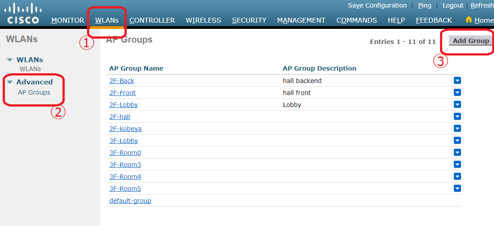

  - 左メニューのAdvancedから「AP groups」を選択。

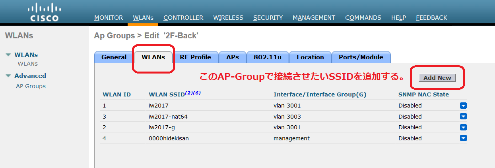

  - 会場レイアウトに合わせて、AP Groupを作成する。(例:ホール前方=hall-front, ホール後方=hall-backなど)
  - 対象のAP-groupを選択し、WLANsのタブでそのAP-Groupから出力したいSSIDを登録する。

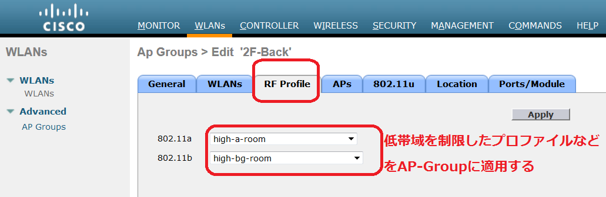

  - RF profileと紐付けて、bitrate制限をしたい場合には、前述のRF Profile作成手順で作成したProfileをこのRF Profileタブで紐付けする。

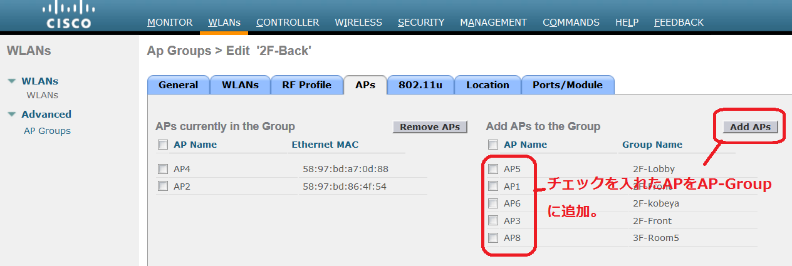

  - 対象のAP-groupを選択し、APsのタブを開き、そのAP-Groupに所属させたいAPを登録する。


## <a name="ts_crib"> トラブルシュート虎の巻 </a>

### <a name="flexconnect_vlan_mix_1"> セグメント(VLAN)が混ざったような挙動を示す場合の対処 その1 </a>

APごとの__VLAN Support__が正しく設定されていないと、全てのトラフィックが上流にタグ無しで出て行く場合がある。
"その1"で述べた内容が大丈夫でも事象が継続する場合、接続中のAPの当該項目を確認すること。

### <a name="flexconnect_vlan_mix_2"> FlexConnect利用時にセグメント(VLAN)が混ざったような挙動を示す場合の対処 その2</a>

WLCにおけるこれまでの設定順序を逸脱した場合やWLANsにてSSIDの増減をAP登録後に行った場合に、USER用SSIDに接続しているにも関わらずMGMTセグメントのアドレスが降ってくるor疎通ができてしまうなど、VLAN-SSIDのマッピングが崩れたような事象が発生することがある。このような場合、FlexConnect Groupsを設定して修正できる。

1. FlexConnect Groupを作成する
  1. WIRELESS – FlexConnect Groups にてNew..ボタンを押しグループを新規作成する(以下は作成済み)


1. APをFlexConnect Groupに登録する
  1. 全APを登録すること。漏れていると一部APに事象が残る。


1. WLAN-VLAN Mappingを設定する
  1. SSIDと上流VLAN IDの組合せをAddする


本来は事前に設定したInterfaceとSSIDの設定にしたがってマッピングが作成されるが、SSIDの削除／再追加などを行うとこれが崩れる場合がある。この様な場合にこの手順を踏む。


### <a name="client_load_balancing"> 無線LANクライアントの接続が頻繁に切れる場合 </a>

Client Load Balancing 機能が悪い方向に働いている可能性があります。
WLANｓ以下のSSIDに対応するプロファイルの「Client Load Balancing」のチェックボックスを外すと改善する場合があります。
ただし設定変更時には一度すべてのクライアントの接続が切れるので注意。

### <a name="loadprofile_failed"> 各APのLoadProfileステータスがFailedになる </a>

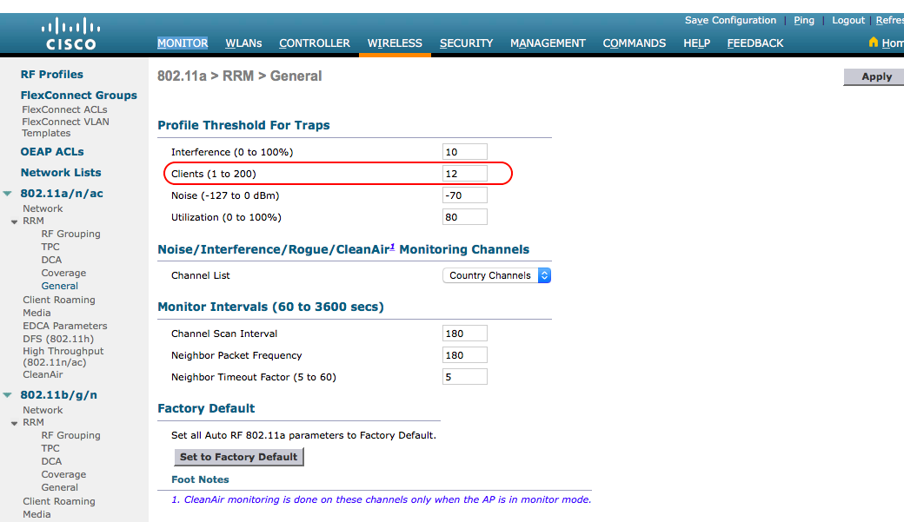

上記の画面において、LoadProfileがFailedと表示されることがあります。
これは以下の「Client」の数値が閾値となっていて、各APでこの閾値を超えると「LoadProfile: Failed」と表示されてしまいます。

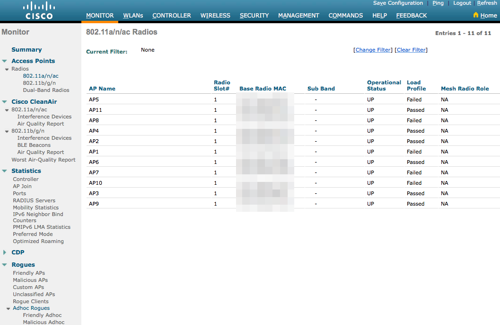

### <a name="management_via_wireless"> 無線LANからWLCのGUIにアクセスできない場合 </a>

管理用VLAN用のSSIDを用意した場合であってもWLCのGUIにアクセスできない場合は、Management Via Wireless項にあるEnable Controller Management to be accessible from Wireless Clientsのチェックを入れる。

MANAGEMENT -> Management Via Wireless

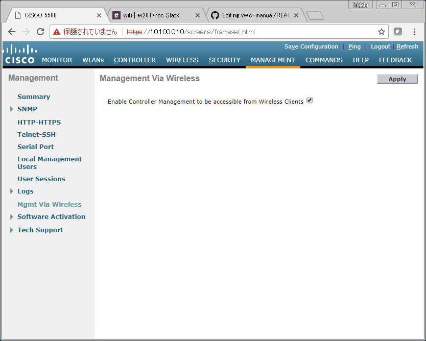


### <a name="client_load_balancing"> WLCとAPとの接続に不具合が見受けられる場合 </a>

1. APはDHCPのアドレスを取れており、かつ、APからWLCへのpingは飛ぶのに、joinが出来ない場合

結論としてはdefault gateway設定の見直しとdefault gatewayに指定されているVPCルータのstatic route設定が必要。

事象が発生している場合、以下のようなメッセージがAPのシリアルコンソール上に表示されている。

    %CAPWAP-3-DHCP_RENEW: Could not discover WLC. Either IP address is not assigned or assigned IP is wrong. Renewing DHCP IP.
    %LWAPP-3-LWAPP_INTERFACE_GOT_IP_ADDRESS: Interface BVI1 obtained IP from DHCP...
    %DHCP-6-ADDRESS_ASSIGN: Interface BVI1 assigned DHCP address 10.25.0.134, mask 255.255.255.0, hostname 18b-ve5-ap04

WLCからAPに向けてpingが届くか確認する。Webインターフェイスの右上からpingコマンドを実行できる。
pingが届かない場合、APへのrouteが無いことがわかる。

ただし、WLCのManagement設定にstatic routeを記述しようとすると、「gateway need to be on service port subnet」というエラーが出る。
このエラーが出た時の環境は、会場が2Fと5Fの2つに分かれている会場で、各フロアのAPをそれぞれ別のmgmtネットワークにて管理しjoinさせる構成だった。
(1フロア分のmgmtネットワークについては疎通、2フロア目のmgmtネットワークについては不通という状態であった。)

この場合、おそらく現在のバージョンのWLCの仕様と思われるが、同一インターフェイス上で2つのmgmtネットワークについて通信させる場合に、static routeを設定するために必要とされている"service port"というものの追加設定ができない。
回避する方法として、VPCルータを1hop挟むことになるが、VPCルータ上に2つの会場向けのstatic routeを記述し、WLCのdefault gatewayはVPCルータに向けることで事象が解決した。

